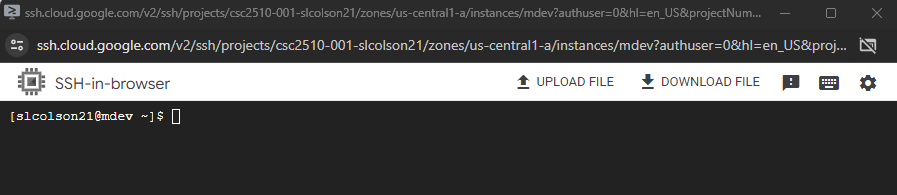
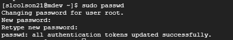

# Automated Server Configuration, Deployment, and Maintenance for Multiple Environments

## Ansible Playbooks

### Playbook Structure

Create a directory structure for Ansible playbooks:

- `ansible-playbooks/`
  - `dev/`
    - `web-server.yaml`
    - `db-server.yaml`
  - `test/`
    - `web-server.yaml`
    - `db-server.yaml`
  - `prod/`
    - `web-server.yaml`
    - `db-server.yaml`

### Playbook Content

- `web-server.yaml` for each environment:
  - Install Apache and Node.js.
  - Deploy the web application using a shell script.
- `db-server.yaml` for each environment:
  - Install MariaDB.

## Bash Shell Script

### Script Structure

Create a bash script for server environment setup and deployment:

- `setup-and-deploy.sh`

### Script Content

- Prompt the user for configuration parameters (e.g., IP addresses, Git branch).
- Invoke the relevant Ansible playbook based on the specified environment.
- Implement error handling and logging.

## Cron Jobs

### Cron Job Setup

Create two separate shell scripts for cron jobs:

- `run-ansible-playbooks.sh`
  - Schedule to run Ansible playbooks for environment setup and web app deployment every minute.
- `check-package-vers


# 1. Create the VMs for the Ansible Control Nodes:
We will do the following 3 times for the management nodes. 

* In the GCP Console, navigate to the Compute Engine section.
* Click on "Create Instance" to create a new VM instance.
* Under Name I will use the following conventions for clarity. 
    * mtest
    * mdev
    * mprod

Note: these naming conventions are for tutorial purposes and may not be acceptable for security reasons. They should not be taken as standard.

* Choose a region. I will be using us-central1 (Iowa) for this tutorial but it may be more secure to vary the locations in the future. 
* Choose E2
* Change the machine type to e2-small
* Under "Boot disk", choose Centos and version Centos 7 (I will use Centos 7 for all of the machines)
* Then click on "Create"

Next we will create development, testing, and production machines for two different environments: one that will be a web server which we will call vm1 and the other that will be both a web server and a database server which we will call vm2. This will create six new machines for a total of nine machines. You will do the following six times, once for each name.

* Click on "Create Instance" to create a new VM instance.
* Under Name I will use the following conventions for clarity. 
    * vm1test
    * vm1dev
    * vm1prod
    * vm2test
    * vm2dev
    * vm2prod
* Choose a region.  
* Choose E2
* Change the machine type to e2-small
* Under "Boot disk", choose Centos and version Centos 7 (I will use Centos 7 for all of the machines)
* Under "Firewall" check "Allow HTTP traffic" and "Allow HTTPS traffic"
* Then click on "Create"


# Configuring Management Nodes
This section pertains to mdev, mtest, and mprod.
* Click on the dropdown next to ssh to the right of mdev and open in browser. 
* Click on authorize.

This should look familiar if you have worked in a Linux or CLI type environment before. You should see something like the following:



First, set a password:

$ ```sudo passwd```

Note that you will not be able to see what you are typing here. Also, you will be asked for confirmation. 



This environment is pretty close to empty. The following installs will probably be handy:

$ ```sudo yum install -y nano git ansible```

* sudo will allow you to install these as the root user
* yum is used because this is a Centos environment, if you created a Debian environment you will need to use apt-get
* -y confirms the installation command, otherwise you will need to type 'yes' when prompted
* nano git ansible are the 3 primary packages being installed. You will see pages of dependencies being installed with this command as each of these packages relies on other packages to do their work. 


Once you have started your virtual machine:
sudo yum install -y git nano ansible openssh-server
sudo systemctl start sshd
sudo systemctl enable sshd
sudo firewall-cmd --add-service=ssh --permanent
sudo firewall-cmd --reload
ssh-keygen -t rsa -b 2048
sudo passwd
 -- set your password

* open your gitbash or terminal 
cat ~/.ssh/id_rsa.pub
-- copy this 

back to your virtual machine
nano .ssh/authorized_keys
-- paste your public key under the key that is already listed

* go back to git bash
ssh <username>@<external ip>

mkdir ansible_playbooks
cd ansible_playbooks && nano gcp_setup.yaml

ansible-galaxy collection install community.general -->
